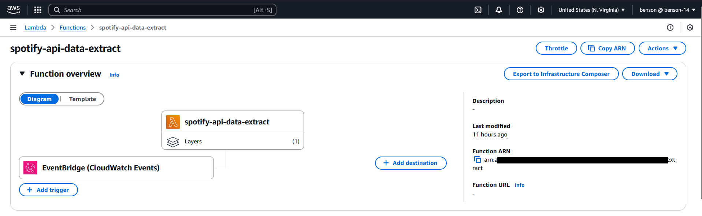
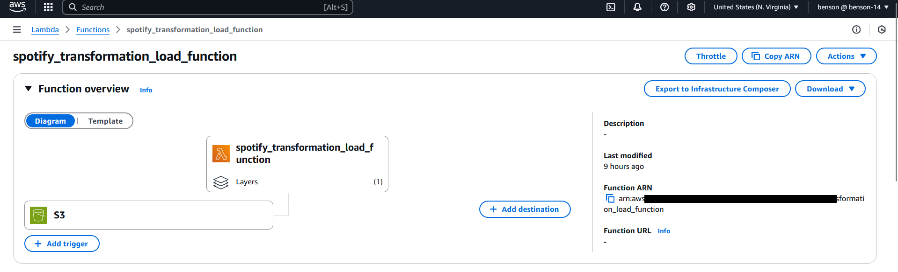
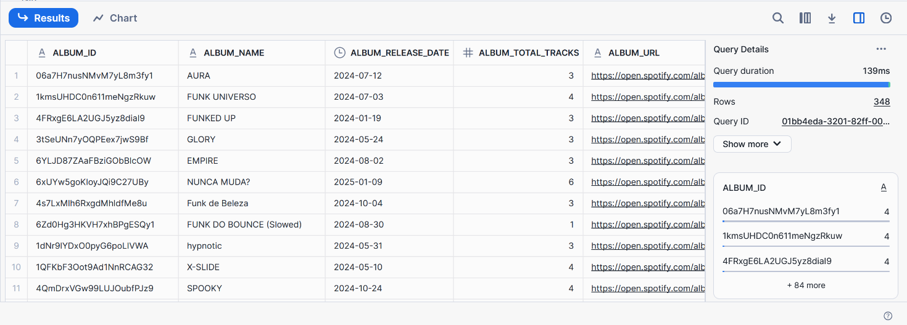

# Spotify ETL Pipeline using AWS & Snowflake
This project implements an ETL (Extract, Transform, Load) pipeline to fetch global trending songs from Spotify's API and process the data using AWS and Snowflake.

## **Pipeline Overview:**


### **1. Extraction**
- A **Python script** extracts data from **Spotify's API**.
- This process is automated using **AWS Lambda**, triggered daily by **Amazon CloudWatch**.
- The extracted raw data is stored in an **Amazon S3 bucket**.
  


```python
import json
import os
import spotipy
from spotipy.oauth2 import SpotifyClientCredentials
import boto3
from datetime import datetime

def lambda_handler(event, context):
    
    cilent_id = os.environ.get('client_id')
    client_secret = os.environ.get('client_secret')
    
    client_credentials_manager = SpotifyClientCredentials(client_id=cilent_id, client_secret=client_secret)
    sp = spotipy.Spotify(client_credentials_manager = client_credentials_manager)
    playlists = sp.user_playlists('spotify')
    
    playlist_link = "https://open.spotify.com/playlist/37i9dQZEVXbNG2KDcFcKOF?si=1333723a6eff4b7f"
    playlist_URI = playlist_link.split("/")[-1].split("?")[0]
    
    spotify_data = sp.playlist_tracks(playlist_URI)   
    
    cilent = boto3.client('s3')
    
    filename = "spotify_raw_" + str(datetime.now()) + ".json"
    
    cilent.put_object(
        Bucket="spotify-etl-project-benson",
        Key="raw_data/to_processed/" + filename,
        Body=json.dumps(spotify_data)
        )

```


### **2. Transformation**
- The raw data is retrieved from **S3** and transformed using **AWS Lambda**.
- The transformed data is then stored back in **S3**.
- **AWS triggers** automate the transformation process upon data arrival.



```python
import json
import boto3
from datetime import datetime
from io import StringIO
import pandas as pd 

def album(data):
    album_list = []
    for row in data['items']:
        album_id = row['track']['album']['id']
        album_name = row['track']['album']['name']
        album_release_date = row['track']['album']['release_date']
        album_total_tracks = row['track']['album']['total_tracks']
        album_url = row['track']['album']['external_urls']['spotify']
        album_element = {'album_id':album_id,'name':album_name,'release_date':album_release_date,
                            'total_tracks':album_total_tracks,'url':album_url}
        album_list.append(album_element)
    return album_list
    
def artist(data):
    artist_list = []
    for row in data['items']:
        for key, value in row.items():
            if key == "track":
                for artist in value['artists']:
                    artist_dict = {'artist_id':artist['id'], 'artist_name':artist['name'], 'external_url': artist['href']}
                    artist_list.append(artist_dict)
    return artist_list
    
def songs(data):
    song_list = []
    for row in data['items']:
        song_id = row['track']['id']
        song_name = row['track']['name']
        song_duration = row['track']['duration_ms']
        song_url = row['track']['external_urls']['spotify']
        song_popularity = row['track']['popularity']
        song_added = row['added_at']
        album_id = row['track']['album']['id']
        artist_id = row['track']['album']['artists'][0]['id']
        song_element = {'song_id':song_id,'song_name':song_name,'duration_ms':song_duration,'url':song_url,
                        'popularity':song_popularity,'song_added':song_added,'album_id':album_id,
                        'artist_id':artist_id
                       }
        song_list.append(song_element)
        
    return song_list
    
def lambda_handler(event, context):
    s3 = boto3.client('s3')
    Bucket = "spotify-etl-project-darshil"
    Key = "raw_data/to_processed/"
    
    spotify_data = []
    spotify_keys = []
    for file in s3.list_objects(Bucket=Bucket, Prefix=Key)['Contents']:
        file_key = file['Key']
        if file_key.split('.')[-1] == "json":
            response = s3.get_object(Bucket = Bucket, Key = file_key)
            content = response['Body']
            jsonObject = json.loads(content.read())
            spotify_data.append(jsonObject)
            spotify_keys.append(file_key)
            
    for data in spotify_data:
        album_list = album(data)
        artist_list = artist(data)
        song_list = songs(data)
        
        album_df = pd.DataFrame.from_dict(album_list)
        album_df = album_df.drop_duplicates(subset=['album_id'])
        
        artist_df = pd.DataFrame.from_dict(artist_list)
        artist_df = artist_df.drop_duplicates(subset=['artist_id'])
        
        #Song Dataframe
        song_df = pd.DataFrame.from_dict(song_list)
        
        album_df['release_date'] = pd.to_datetime(album_df['release_date'])
        song_df['song_added'] =  pd.to_datetime(song_df['song_added'])
        
        songs_key = "transformed_data/songs_data/songs_transformed_" + str(datetime.now()) + ".csv"
        song_buffer=StringIO()
        song_df.to_csv(song_buffer, index=False)
        song_content = song_buffer.getvalue()
        s3.put_object(Bucket=Bucket, Key=songs_key, Body=song_content)
        
        album_key = "transformed_data/album_data/album_transformed_" + str(datetime.now()) + ".csv"
        album_buffer=StringIO()
        album_df.to_csv(album_buffer, index=False)
        album_content = album_buffer.getvalue()
        s3.put_object(Bucket=Bucket, Key=album_key, Body=album_content)
        
        artist_key = "transformed_data/artist_data/artist_transformed_" + str(datetime.now()) + ".csv"
        artist_buffer=StringIO()
        artist_df.to_csv(artist_buffer, index=False)
        artist_content = artist_buffer.getvalue()
        s3.put_object(Bucket=Bucket, Key=artist_key, Body=artist_content)
        
    s3_resource = boto3.resource('s3')
    for key in spotify_keys:
        copy_source = {
            'Bucket': Bucket,
            'Key': key
        }
        s3_resource.meta.client.copy(copy_source, Bucket, 'raw_data/processed/' + key.split("/")[-1])    
        s3_resource.Object(Bucket, key).delete()
```

### **3. Loading**
- The transformed data is loaded into **Snowflake** using **Snowpipe**.
- AWS and Snowflake integration ensures seamless data transfer.



```sql
CREATE OR REPLACE DATABASE spotify_db;

CREATE OR REPLACE SCHEMA spotify_db.tf_data;

CREATE OR REPLACE STORAGE INTEGRATION s3_init_spotify
    TYPE = EXTERNAL_STAGE
    STORAGE_PROVIDER = S3
    ENABLED = TRUE
    STORAGE_AWS_ROLE_ARN = 'arn:aws:iam::650251726989:role/snowflake-s3-connection'
    STORAGE_ALLOWED_LOCATIONS = ('s3://spotify-etl-project-benson')
    COMMENT = 'Creating connection to S3';

DESC INTEGRATION s3_init_spotify

CREATE OR REPLACE FILE FORMAT SPOTIFY_DB.TF_DATA.CSV_FILE
TYPE = 'CSV'
FIELD_DELIMITER = ','             
SKIP_HEADER = 1                   
FIELD_OPTIONALLY_ENCLOSED_BY = '"' 

CREATE OR REPLACE STAGE SPOTIFY_DB.TF_DATA.s3_spotify_stage
    URL = 's3://spotify-etl-project-benson/transformed_data/'
    STORAGE_INTEGRATION = s3_init_spotify
    FILE_FORMAT = SPOTIFY_DB.TF_DATA.CSV_FILE;


LIST @SPOTIFY_DB.TF_DATA.s3_spotify_stage
LIST @SPOTIFY_DB.TF_DATA.s3_spotify_stage/album_data/;

CREATE OR REPLACE TABLE SPOTIFY_DB.PUBLIC.Album (
    album_id VARCHAR,
    album_name VARCHAR,
    album_release_date DATE,
    album_total_tracks INT,
    album_url VARCHAR
);

CREATE OR REPLACE TABLE SPOTIFY_DB.PUBLIC.Artist (
    artist_id VARCHAR,
    artist_name VARCHAR,
    external_url VARCHAR
);

CREATE OR REPLACE TABLE SPOTIFY_DB.PUBLIC.Songs (
    song_id VARCHAR,
    song_name VARCHAR,
    song_duration INT,
    song_url VARCHAR,
    song_popularity INT,
    song_added DATETIME,
    album_id VARCHAR,
    artist_id VARCHAR
);

TRUNCATE TABLE SPOTIFY_DB.PUBLIC.Album;
TRUNCATE TABLE SPOTIFY_DB.PUBLIC.Artist;
TRUNCATE TABLE SPOTIFY_DB.PUBLIC.Songs;

COPY INTO SPOTIFY_DB.PUBLIC.Album
FROM @SPOTIFY_DB.TF_DATA.s3_spotify_stage
PATTERN = '.*album_data/.*' 
FORCE = TRUE;

COPY INTO SPOTIFY_DB.PUBLIC.Artist 
FROM @SPOTIFY_DB.TF_DATA.s3_spotify_stage
PATTERN = '.*artist_data/.*' 
FORCE = TRUE;

COPY INTO SPOTIFY_DB.PUBLIC.Songs 
FROM @SPOTIFY_DB.TF_DATA.s3_spotify_stage
PATTERN = '.*songs_data/.*' 
FORCE = TRUE;

SELECT * FROM SPOTIFY_DB.PUBLIC.Album;
SELECT * FROM SPOTIFY_DB.PUBLIC.Artist;
SELECT * FROM SPOTIFY_DB.PUBLIC.Songs;

// Creating Pipes for Auto Ingestion 

CREATE OR REPLACE PIPE SPOTIFY_DB.TF_DATA.ALBUM_PIPE 
AUTO_INGEST = TRUE
AS
COPY INTO SPOTIFY_DB.PUBLIC.Album
FROM @SPOTIFY_DB.TF_DATA.s3_spotify_stage
PATTERN = 'album_data/.*' 

CREATE OR REPLACE PIPE SPOTIFY_DB.TF_DATA.ARTIST_PIPE 
AUTO_INGEST = TRUE 
AS 
COPY INTO SPOTIFY_DB.PUBLIC.Artist
FROM @SPOTIFY_DB.TF_DATA.s3_spotify_stage 
PATTERN = 'artist_data/.*' 

CREATE OR REPLACE PIPE SPOTIFY_DB.TF_DATA.SONG_PIPE
AUTO_INGEST = TRUE 
AS 
COPY INTO SPOTIFY_DB.PUBLIC.Songs
FROM @SPOTIFY_DB.TF_DATA.s3_spotify_stage 
PATTERN = 'songs_data/.*' 

DESC PIPE SPOTIFY_DB.TF_DATA.album_pipe;

SELECT * FROM spotify_db.public.album;
SELECT * FROM spotify_db.public.artist;
SELECT * FROM spotify_db.public.songs;

```
