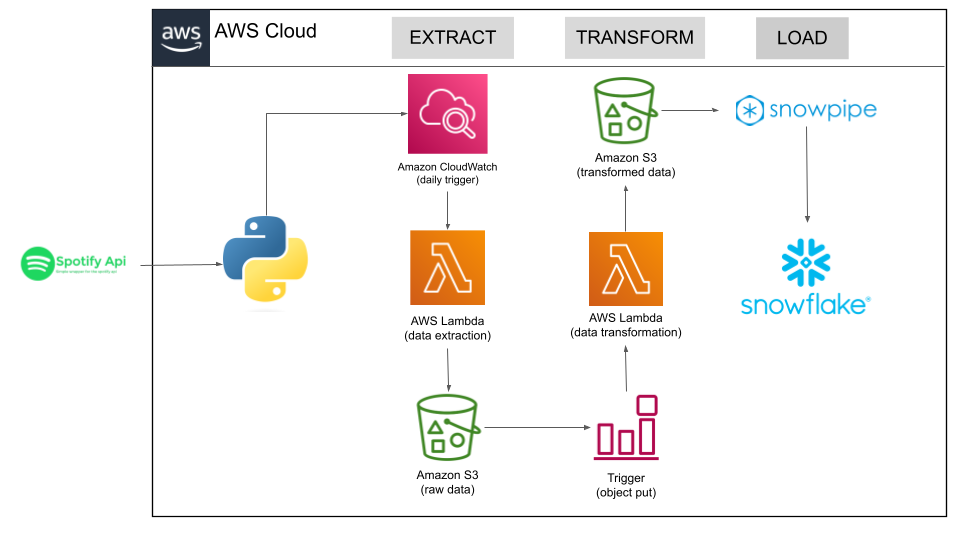

# Spotify ETL Pipeline using AWS & Snowflake

# Project Overview 

This Spotify ETL Architecture in AWS Cloud automates data extraction, transformation, and loading into Snowflake for analysis.

Extract:
    Spotify API: Fetches streaming data.
    AWS Lambda: Extracts data from the API.
    Amazon CloudWatch: Triggers the Lambda function daily.
    Amazon S3 (Raw Data): Stores extracted data.
   
Transform:
    S3 Trigger: Detects new raw data and triggers transformation.
    AWS Lambda: Processes and cleans the data.
    Amazon S3 (Transformed Data): Stores the cleaned data.

Load:
    Snowpipe: Automates loading of transformed data into Snowflake.
    Snowflake: Stores structured data for analytics.
